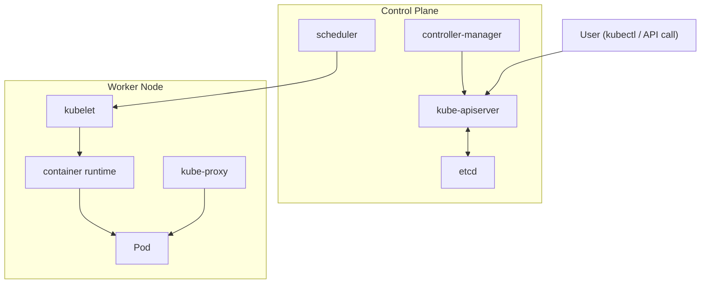
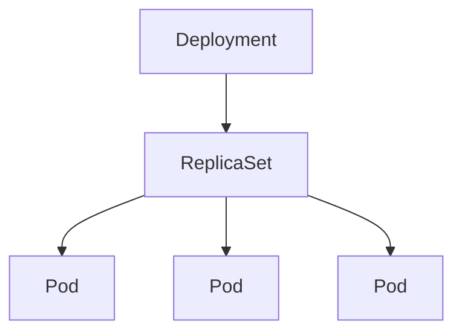
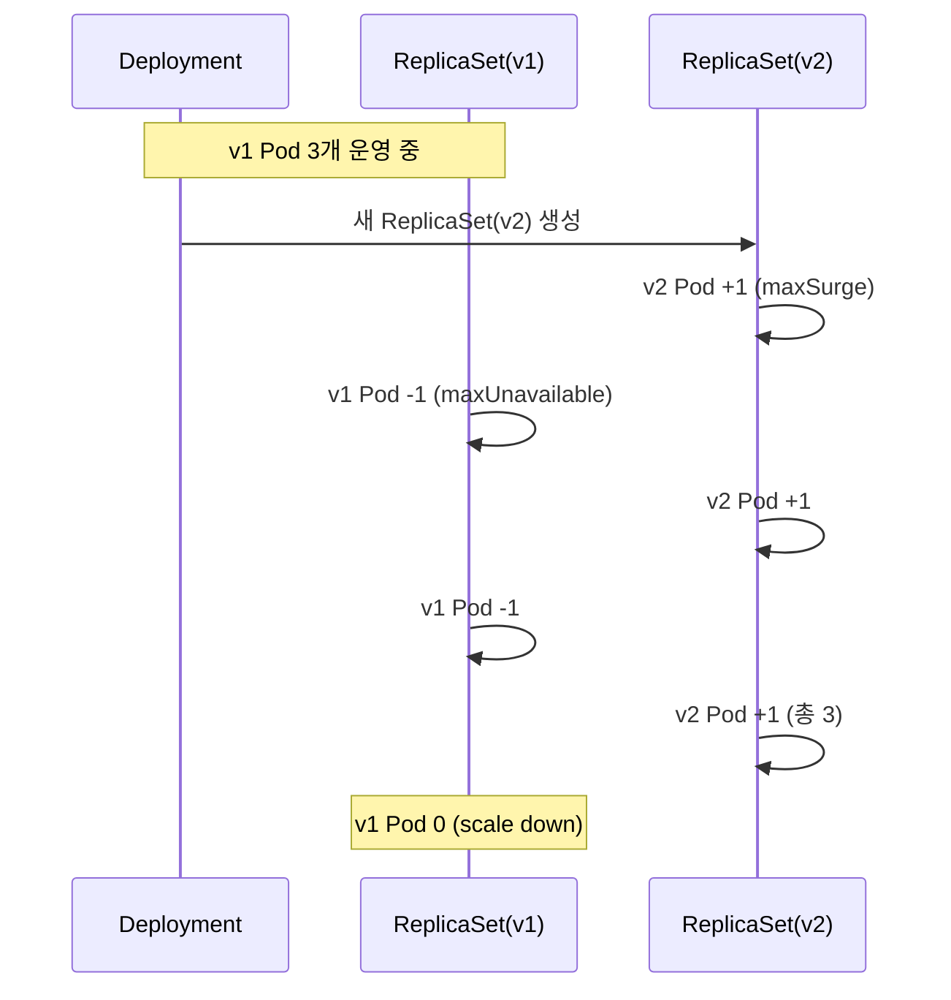

## Kubernetes 전체 구조 먼저 보기

```
Pod
= 앱 실행 단위

ReplicaSet
= Pod 수 유지

Deployment
= 배포 / 업데이트 / 복구 관리
```

```
Kubernetes Cluster
├── Control Plane
│   ├── kube-apiserver
│   ├── etcd
│   ├── scheduler
│   ├── controller-manager
│   └── cloud-controller-manager
│
└── Worker Node
    ├── kubelet
    ├── kube-proxy
    ├── container runtime
    └── Pod
        └── Container
```



| 구성 요소                    | 키워드               | 역할                                                  |
| ---------------------------- | -------------------- | ----------------------------------------------------- |
| **Cluster**                  | 전체 실행 환경       | Control Plane + Worker Node                           |
| **Control Plane**            | 클러스터 두뇌        | 클러스터 전체 상태 관리                               |
| **kube-apiserver**           | Kubernetes API 입구  | 모든 요청의 진입점, 리소스 생성/조회/수정/삭제 처리   |
| **etcd**                     | 상태 저장소          | 클러스터 상태와 설정 데이터 저장                      |
| **scheduler**                | Pod 배치 담당        | 새 Pod를 어떤 Node에 실행할지 결정                    |
| **controller-manager**       | 상태 조정 관리자     | 원하는 상태와 현재 상태 차이를 감지하고 조정          |
| **cloud-controller-manager** | 클라우드 연동 관리자 | AWS/GCP/Azure 같은 클라우드 리소스와 Kubernetes 연결  |
| **Worker Node**              | 실제 실행 서버       | 애플리케이션 Pod가 실행되는 서버                      |
| **kubelet**                  | Node 에이전트        | Node에서 Pod가 정상 실행되도록 관리                   |
| **kube-proxy**               | 네트워크 프록시      | Service 트래픽을 적절한 Pod로 전달                    |
| **container runtime**        | 컨테이너 실행 엔진   | containerd, CRI-O 등 실제 컨테이너 실행 담당          |
| **Pod**                      | 최소 실행 단위       | 하나 이상의 컨테이너를 묶는 Kubernetes 기본 실행 단위 |
| **Container**                | 앱 프로세스          | 실제 애플리케이션이 실행되는 단위                     |
| **ReplicaSet**               | Pod 개수 유지        | 원하는 replica 수 보장                                |
| **Deployment**               | 배포 관리자          | ReplicaSet + Pod 선언적 관리                          |
| **Service**                  | 고정 진입점          | 변하는 Pod IP 추상화                                  |
| **Ingress / Gateway**        | 외부 트래픽 입구     | HTTP/S 라우팅                                         |
| **ConfigMap**                | 일반 설정            | 환경 변수, 설정 파일                                  |
| **Secret**                   | 민감 설정            | 비밀번호, 토큰, 키                                    |
| **Probe**                    | 상태 검사            | Liveness / Readiness / Startup                        |
| **HPA**                      | 자동 확장            | 부하 기반 Pod 수 조절                                 |

### 구조 요약

```
Control Plane
= 클러스터의 상태를 관리하는 영역

Worker Node
= 실제 애플리케이션이 실행되는 영역

kubelet
= Worker Node에서 Pod 실행을 책임지는 에이전트

kube-proxy
= Service 트래픽을 Pod로 연결하는 네트워크 구성 요소

container runtime
= 컨테이너를 실제로 실행하는 런타임

Deployment
= 애플리케이션 배포와 업데이트를 관리하는 상위 리소스

ReplicaSet
= Deployment 아래에서 Pod 개수를 유지하는 리소스

Pod
= 컨테이너가 들어가는 Kubernetes 최소 실행 단위
```

### 주요 흐름

```
사용자
↓
kubectl / API 요청
↓
kube-apiserver
↓
etcd에 상태 저장
↓
scheduler가 Pod 배치 결정
↓
Worker Node의 kubelet이 Pod 실행
↓
container runtime이 컨테이너 실행
↓
Service와 kube-proxy가 트래픽 연결
```

---

## 주요 모듈 한눈에 보기

### 주요 모듈

- **Pod**: 컨테이너가 실행되는 최소 단위(네트워크/스토리지 공유)
- **ReplicaSet**: Pod 개수(`replicas`)를 항상 맞춰주는 장치
- **Deployment**: ReplicaSet을 통해 배포, 점진 업데이트, 복구를 관리하는 상위 리소스
- **Service**: 변하는 Pod IP 앞에 “고정 진입점”을 제공해 트래픽을 Pod로 분산

---

## Deployment란?

```
Deployment
= 원하는 애플리케이션 상태를 선언하는 리소스
= ReplicaSet을 통해 Pod를 관리하는 컨트롤러
= 무상태 애플리케이션 배포의 기본 리소스
```

### 핵심 개념

| 개념               | 의미                                  |
| ------------------ | ------------------------------------- |
| **Desired State**  | 원하는 상태                           |
| **Current State**  | 현재 상태                             |
| **Reconciliation** | 현재 상태를 원하는 상태로 맞추는 과정 |
| **Controller**     | 상태 차이를 감지하고 조정하는 주체    |
| **Declarative**    | “어떻게”보다 “무엇을” 선언            |

---

## Deployment 동작 구조

```
Deployment
└── ReplicaSet
    ├── Pod
    ├── Pod
    └── Pod
```



### 역할 분리

| 계층           | 역할                                |
| -------------- | ----------------------------------- |
| **Deployment** | 배포 전략, 버전 관리, 업데이트 관리 |
| **ReplicaSet** | Pod 개수 유지                       |
| **Pod**        | 실제 컨테이너 실행                  |
| **Container**  | 애플리케이션 프로세스 실행          |

### 예시 흐름

```
사용자 선언:
nginx Pod 3개 필요

Deployment:
ReplicaSet 생성

ReplicaSet:
Pod 3개 생성

Pod 1개 장애:
현재 2개

ReplicaSet:
새 Pod 1개 생성

결과:
다시 3개
```

---

## Deployment YAML 구조

```
apiVersion: apps/v1
kind: Deployment
metadata:
  name: nginx-deployment

spec:
  replicas: 3

  selector:
    matchLabels:
      app: nginx

  template:
    metadata:
      labels:
        app: nginx

    spec:
      containers:
        - name: nginx
          image: nginx:1.16.1
          ports:
            - containerPort: 80
```

```bash
kubectl apply -f deployment.yaml
```

### 필드별 키워드

| 필드                       | 키워드                  |
| -------------------------- | ----------------------- |
| `apiVersion`               | API 버전                |
| `kind`                     | 리소스 종류             |
| `metadata.name`            | Deployment 이름         |
| `spec.replicas`            | 원하는 Pod 개수         |
| `spec.selector`            | 관리 대상 Pod 선택 기준 |
| `spec.template`            | Pod 생성 템플릿         |
| `template.metadata.labels` | Pod 라벨                |
| `containers.name`          | 컨테이너 이름           |
| `containers.image`         | 컨테이너 이미지         |
| `containerPort`            | 컨테이너 내부 포트      |

### 주의 포인트

```
selector.matchLabels
=
template.metadata.labels

같아야 함
```

---

## Deployment 핵심 기능

### Replica 유지

```
replicas: 3
```

### 의미

```
항상 Pod 3개 유지
```

### 장애 상황

```
Pod 3개 실행 중
↓
Pod 1개 장애
↓
현재 Pod 2개
↓
ReplicaSet이 새 Pod 1개 생성
↓
다시 Pod 3개
```

### 키워드

| 키워드               | 의미                        |
| -------------------- | --------------------------- |
| Desired replicas     | 원하는 Pod 수               |
| Current replicas     | 현재 Pod 수                 |
| Available replicas   | 요청 가능한 Pod 수          |
| Ready replicas       | 준비 완료된 Pod 수          |
| Self-healing         | 장애 Pod 자동 복구          |
| Reconciliation loop  | 원하는 상태로 계속 맞추기   |

---

### Rolling Update

```
Rolling Update
= 기존 Pod를 한 번에 제거하지 않고
= 새 Pod를 조금씩 추가하고
= 기존 Pod를 조금씩 제거하는 배포 방식
```



### 흐름

```
v1 Pod 3개
↓
v2 Pod 1개 생성
↓
v1 Pod 1개 제거
↓
v2 Pod 1개 추가
↓
v1 Pod 1개 제거
↓
v2 Pod 3개 완료
```

### 주요 옵션

| 옵션             | 의미                                         |
| ---------------- | -------------------------------------------- |
| `maxUnavailable` | 업데이트 중 사용 불가능해도 되는 최대 Pod 수 |
| `maxSurge`       | 업데이트 중 추가로 생성 가능한 최대 Pod 수   |

Deployment RollingUpdate 전략의 기본값은 `maxUnavailable: 25%`, `maxSurge: 25%` 기준

---

### Rollback

```
Rollback
= 문제 있는 배포를 이전 안정 버전으로 되돌리는 기능
```

### 명령어

```
kubectl rollout undo deployment/nginx-deployment
```

### 특정 revision으로 복구

```
kubectl rollout undo deployment/nginx-deployment --to-revision=2
```

### 사용 상황

- 잘못된 이미지 태그
- 앱 기동 실패
- `CrashLoopBackOff`
- `ImagePullBackOff`
- Readiness Probe 실패
- 배포 후 5xx 증가
- 응답 지연 증가

---

### Rollout 상태 확인

```
kubectl rollout status deployment/nginx-deployment
```

### 확인 포인트

- rollout 진행 중
- rollout 완료
- rollout 실패
- 새 ReplicaSet 생성 여부
- 기존 ReplicaSet scale-down 여부
- 새 Pod Ready 여부

### 관련 명령어

```bash
kubectl get deployment
kubectl get rs
kubectl get pods
kubectl describe deployment nginx-deployment
kubectl rollout history deployment/nginx-deployment
```

---

## Deployment가 중요한 이유

```
핵심:
수동 복구 → 자동 복구 구조
명령형 운영 → 선언형 운영
서버 중심 운영 → 상태 중심 운영
```

### Deployment 없는 운영

```
서버 접속
프로세스 확인
죽은 프로세스 재시작
로그 확인
스크립트 실행
수동 장애 대응
```

### Deployment 있는 운영

```
원하는 상태 선언
Kubernetes 상태 감시
Pod 장애 감지
새 Pod 생성
Replica 수 복구
```

### 운영 관점 가치

| 관점        | 효과                            |
| ----------- | ------------------------------- |
| 장애 복구   | Pod 장애 시 자동 대체           |
| 배포 안정성 | Rolling Update                  |
| 복구 전략   | Rollback                        |
| 확장성      | replicas 조정                   |
| 운영 일관성 | YAML 기반 선언                  |
| 자동화      | CI/CD와 결합 용이               |
| 관측성      | 상태, 이벤트, rollout 추적 가능 |

```
self-healing
= 실패한 컨테이너 재시작
= 실패한 Pod 대체
= 비정상 Pod 트래픽 제외
```

---

## 카오스 엔지니어링과의 연결

```
Deployment
= 원하는 상태 유지 장치

Chaos Engineering
= 장애 상황에서도 원하는 상태가 유지되는지 검증하는 실험
```

### 관계 요약

| Deployment     | Chaos Engineering   |
| -------------- | ------------------- |
| 복구 구조 제공 | 복구 구조 검증      |
| Pod 수 유지    | Pod 장애 주입       |
| Rolling Update | 배포 실패 실험      |
| Rollback       | 복구 절차 검증      |
| Probe 연계     | 트래픽 차단 검증    |
| Service 연계   | endpoint 전환 검증  |
| HPA 연계       | 부하 증가 대응 검증 |

### 핵심 질문

```
Pod가 죽어도 복구되는가?
새 Pod는 얼마나 빨리 Ready 되는가?
Service 트래픽은 정상 Pod로만 가는가?
잘못된 배포가 전체 장애로 번지지 않는가?
Rollback은 실제로 빠르게 되는가?
알림은 적절하게 울리는가?
```

---

## Deployment 관점 카오스 실험

### 실험 1. Pod 하나 삭제

### 목표

```
Pod 장애 시 Deployment 복구 동작 확인
```

### 명령어

```
kubectl delete pod <pod-name>
```

### 가설

```
replicas=3
Pod 1개 삭제
새 Pod 1개 자동 생성
READY 3/3 상태 회복
Service 요청 영향 최소화
```

### 관찰 명령어

```bash
kubectl get pods -w
kubectl get deployment
kubectl get rs
kubectl describe deployment <deployment-name>
```

### 기대 결과

```
Pod 1개 Terminating
새 Pod 1개 Pending
ContainerCreating
Running
Ready
최종 READY 3/3
```

---

## 참조 문서

- [Kubernetes 공식 문서 - Deployments](https://kubernetes.io/docs/concepts/workloads/controllers/deployment/)
- [Kubernetes 공식 문서 - ReplicaSet](https://kubernetes.io/docs/concepts/workloads/controllers/replicaset/)
- [Kubernetes 공식 문서 - Rolling Update로 Deployment 업데이트하기](https://kubernetes.io/docs/tasks/run-application/update-deployment-rolling-update/)
- [Kubernetes 공식 문서 - kubectl rollout](https://kubernetes.io/docs/reference/kubectl/generated/kubectl_rollout/)
- [Kubernetes 공식 문서 - Pod](https://kubernetes.io/docs/concepts/workloads/pods/)
- [Kubernetes 공식 문서 - Service](https://kubernetes.io/docs/concepts/services-networking/service/)
- [Kubernetes 공식 문서 - Liveness, Readiness, Startup Probes](https://kubernetes.io/docs/concepts/configuration/liveness-readiness-startup-probes/)
