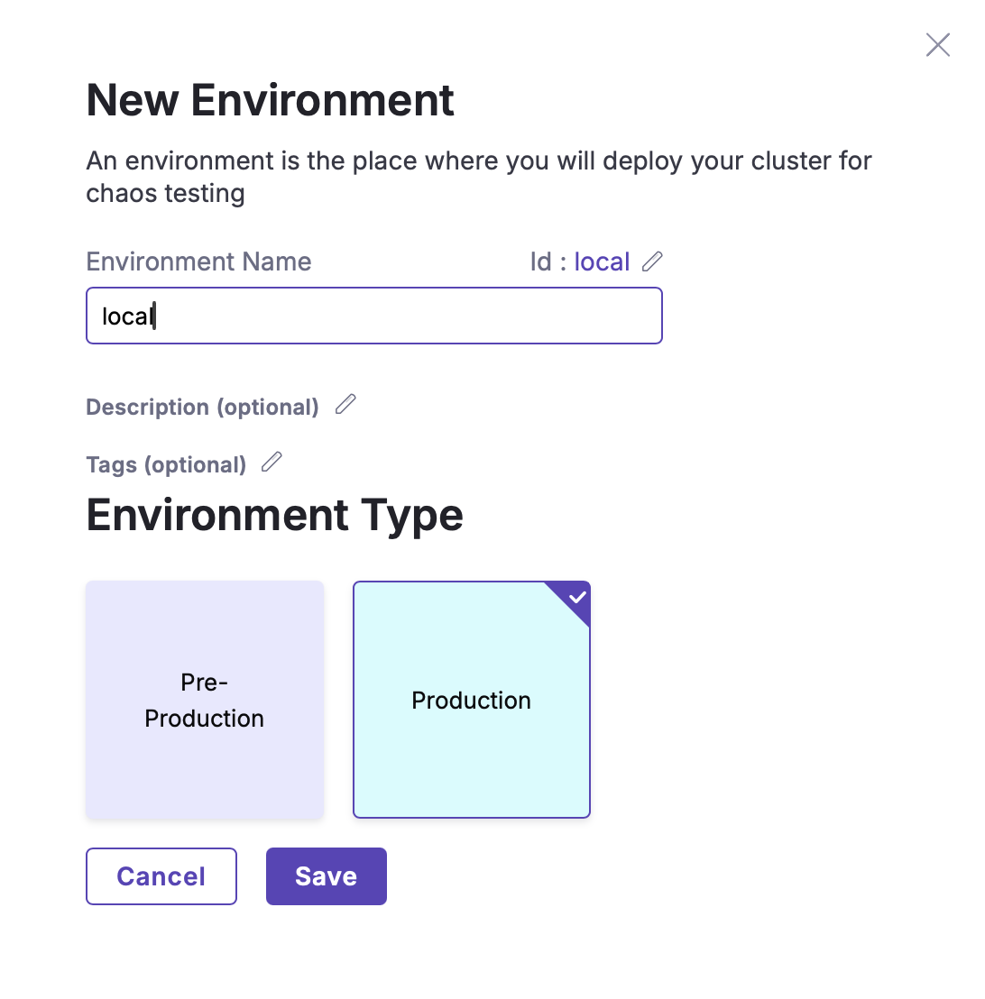
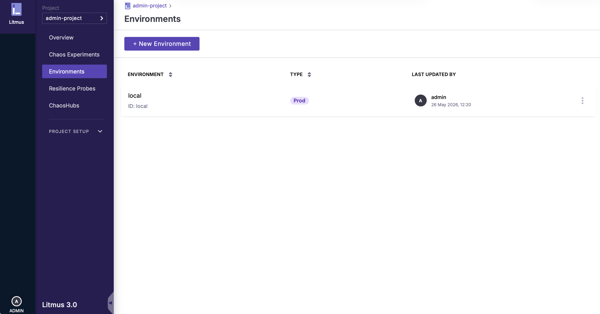
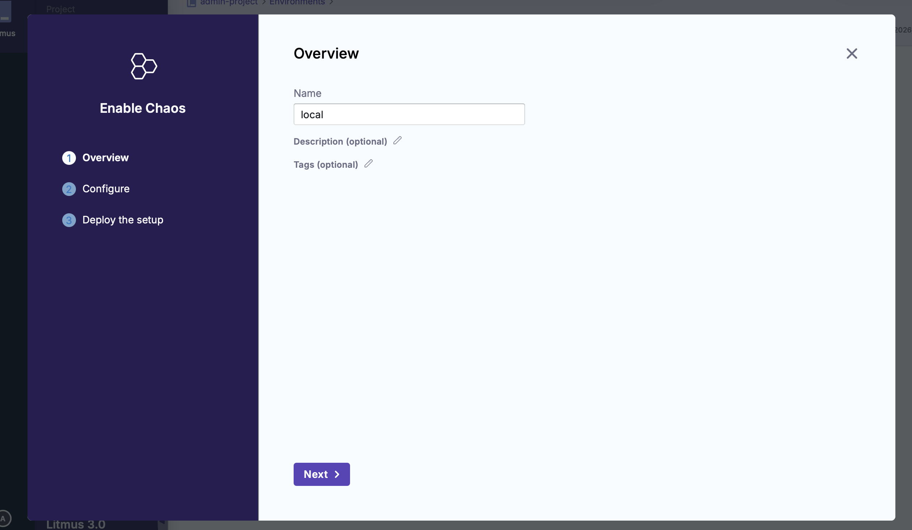
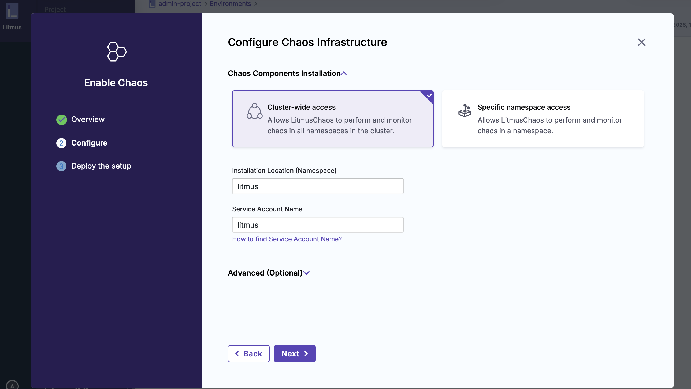
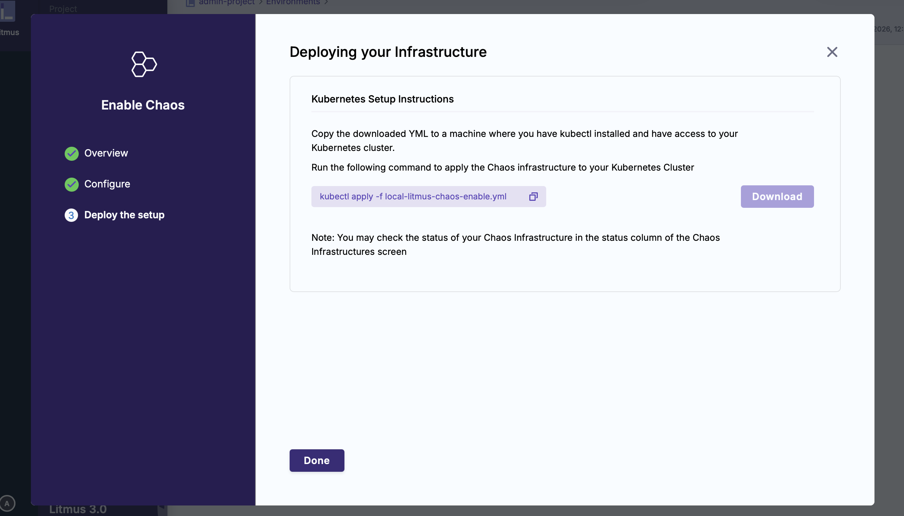

# LitmusChaos 기본 환경 세팅 기록

이 문서는 LitmusChaos `pod-delete` 실험을 실행하기 전 필요한 기본 환경 세팅 과정을 정리한다.

## 1. 실습 환경 준비

### 1.1 Docker Desktop 리소스 설정

로컬 Kubernetes 클러스터와 LitmusChaos 컴포넌트를 안정적으로 실행하기 위해 Docker Desktop 리소스를 다음과 같이 설정했다.

| 항목 | 설정값 |
| --- | --- |
| CPU | 4개 |
| Memory | 8GB |

minikube 클러스터는 Docker driver를 사용했고, 실제 minikube 시작 명령에서는 메모리를 `7168MiB`로 지정했다.

### 1.2 minikube 클러스터 시작

LitmusChaos 실험용 minikube profile 이름은 `litmus-experiments`로 지정했다.

```bash
minikube start --profile=litmus-experiments --cpus=4 --memory=7168 --driver=docker
```

클러스터 상태를 확인했다.

```bash
minikube status --profile=litmus-experiments
```

실행 결과:

```text
litmus-experiments
type: Control Plane
host: Running
kubelet: Running
apiserver: Running
kubeconfig: Configured
```

노드 상태도 확인했다.

```bash
kubectl get nodes
```

실행 결과:

```text
NAME                 STATUS   ROLES           AGE   VERSION
litmus-experiments   Ready    control-plane   37s   v1.35.1
```

## 2. LitmusChaos 설치

### 2.1 Helm repository 추가 및 업데이트

LitmusChaos Helm chart repository를 추가하고 업데이트했다.

```bash
helm repo add litmuschaos https://litmuschaos.github.io/litmus-helm/
helm repo update
```

실행 결과:

```text
"litmuschaos" already exists with the same configuration, skipping
Hang tight while we grab the latest from your chart repositories...
...Successfully got an update from the "litmuschaos" chart repository
...Successfully got an update from the "bitnami" chart repository
Update Complete. ⎈Happy Helming!⎈
```

이미 repository가 등록되어 있었기 때문에 `already exists` 메시지가 출력되었고, 이후 chart repository 업데이트는 정상적으로 완료되었다.

### 2.2 litmus namespace 생성

LitmusChaos 컴포넌트를 설치할 namespace를 생성했다.

```bash
kubectl create ns litmus
```

실행 결과:

```text
namespace/litmus created
```

### 2.3 Helm chart로 LitmusChaos 설치

`litmus` namespace에 LitmusChaos를 설치했다. 로컬 minikube 환경에서 브라우저로 접근하기 위해 frontend service type은 `NodePort`로 설정했다.

```bash
helm install chaos litmuschaos/litmus --namespace=litmus \
  --set portal.frontend.service.type=NodePort \
  --set mongodb.image.registry=docker.io \
  --set mongodb.image.repository=bitnami/mongodb \
  --set mongodb.image.tag=latest \
  --set mongodb.auth.enabled=true \
  --set-string mongodb.auth.rootPassword=litmus1234
```

실행 결과:

```text
NAME: chaos
LAST DEPLOYED: Tue May 26 11:48:29 2026
NAMESPACE: litmus
STATUS: deployed
REVISION: 1
DESCRIPTION: Install complete
TEST SUITE: None
```

Helm release 이름은 `chaos`이고, 설치 namespace는 `litmus`이다.

### 2.4 LitmusChaos Pod 상태 확인

설치 직후에는 일부 Pod가 `Init` 또는 `ContainerCreating` 상태였다.

```bash
kubectl get pods -n litmus
```

초기 확인 결과:

```text
NAME                                        READY   STATUS              RESTARTS   AGE
chaos-litmus-auth-server-6576749b77-gtbnn   0/1     Init:0/1            0          10s
chaos-litmus-frontend-cc4c59b46-qmnvt       0/1     ContainerCreating   0          10s
chaos-litmus-server-7c88f5bc5d-7tlws        0/1     Init:0/1            0          10s
chaos-mongodb-0                             0/1     Init:0/1            0          10s
chaos-mongodb-arbiter-0                     0/1     ContainerCreating   0          10s
```

최종적으로 모든 LitmusChaos 관련 Pod가 `Running` 상태가 된 것을 확인했다.

```text
NAME                                        READY   STATUS    RESTARTS   AGE
chaos-litmus-auth-server-6576749b77-gtbnn   1/1     Running   0          2m43s
chaos-litmus-frontend-cc4c59b46-qmnvt       1/1     Running   0          2m43s
chaos-litmus-server-7c88f5bc5d-7tlws        1/1     Running   0          2m43s
chaos-mongodb-0                             1/1     Running   0          2m43s
chaos-mongodb-1                             1/1     Running   0          82s
chaos-mongodb-2                             1/1     Running   0          49s
chaos-mongodb-arbiter-0                     1/1     Running   0          2m43s
```

여기서 `litmus` namespace의 Pod들은 카오스 실험을 실행하고 관리하는 LitmusChaos 플랫폼 자체를 구성한다.

### 2.5 LitmusChaos 서비스 확인

LitmusChaos 서비스 목록을 확인했다.

```bash
kubectl get svc -n litmus
```

실행 결과:

```text
NAME                               TYPE        CLUSTER-IP      EXTERNAL-IP   PORT(S)                      AGE
chaos-litmus-auth-server-service   ClusterIP   10.103.107.62   <none>        9003/TCP,3030/TCP            15m
chaos-litmus-frontend-service      NodePort    10.97.132.141   <none>        9091:31657/TCP               15m
chaos-litmus-server-service        ClusterIP   10.98.93.63     <none>        9002/TCP,8000/TCP,8889/TCP   15m
chaos-mongodb-arbiter-headless     ClusterIP   None            <none>        27017/TCP                    15m
chaos-mongodb-headless             ClusterIP   None            <none>        27017/TCP                    15m
```

`chaos-litmus-frontend-service`가 `NodePort` 타입으로 생성되었고, `9091` 포트가 노드의 `31657` 포트에 매핑되었다.

### 2.6 LitmusChaos UI 접속

minikube service 명령으로 LitmusChaos frontend에 접근했다.

```bash
minikube service chaos-litmus-frontend-service -n litmus --profile=litmus-experiments
```

실행 결과:

```text
┌───────────┬───────────────────────────────┬─────────────┬───────────────────────────┐
│ NAMESPACE │             NAME              │ TARGET PORT │            URL            │
├───────────┼───────────────────────────────┼─────────────┼───────────────────────────┤
│ litmus    │ chaos-litmus-frontend-service │ http/9091   │ http://192.168.49.2:31657 │
└───────────┴───────────────────────────────┴─────────────┴───────────────────────────┘
🔗  chaos-litmus-frontend-service 서비스의 터널을 시작하는 중
┌───────────┬───────────────────────────────┬─────────────┬────────────────────────┐
│ NAMESPACE │             NAME              │ TARGET PORT │          URL           │
├───────────┼───────────────────────────────┼─────────────┼────────────────────────┤
│ litmus    │ chaos-litmus-frontend-service │             │ http://127.0.0.1:55960 │
└───────────┴───────────────────────────────┴─────────────┴────────────────────────┘
🎉  Opening service litmus/chaos-litmus-frontend-service in default browser...
❗  darwin 에서 Docker 드라이버를 사용하고 있기 때문에, 터미널을 열어야 실행할 수 있습니다.
```

macOS에서 Docker driver를 사용하는 minikube는 터널을 통해 `127.0.0.1` 주소를 제공한다. 이 실습에서는 다음 주소로 LitmusChaos UI에 접속했다.

```text
http://127.0.0.1:55960
```

LitmusChaos 초기 로그인 계정은 다음과 같다.

| 항목 | 값 |
| --- | --- |
| Username | `admin` |
| Password | `litmus` |

## 3. 실험 대상 애플리케이션 배포

### 3.1 Podtato-head 배포

LitmusChaos 공식 튜토리얼에서 사용하는 Podtato-head 샘플 애플리케이션을 배포했다.

```bash
kubectl apply -f https://github.com/podtato-head/podtato-head-app/releases/download/v0.3.3/manifest.yaml
```

실행 결과:

```text
namespace/podtato-kubectl created
deployment.apps/podtato-head-frontend created
deployment.apps/podtato-head-left-arm created
deployment.apps/podtato-head-right-arm created
deployment.apps/podtato-head-left-leg created
deployment.apps/podtato-head-right-leg created
deployment.apps/podtato-head-hat created
service/podtato-head-frontend created
service/podtato-head-left-leg created
service/podtato-head-right-leg created
service/podtato-head-left-arm created
service/podtato-head-right-arm created
service/podtato-head-hat created
networkpolicy.networking.k8s.io/allow-ingress-only-from-frontend created
configmap/podtato-head-discovery created
```

manifest 적용 시 `podtato-kubectl` namespace가 함께 생성되었고, frontend, hat, left/right-arm, left/right-leg 컴포넌트가 각각 Deployment와 Service로 생성되었다.

### 3.2 pod-delete 대상 Deployment 라벨 설정

Podtato-head 튜토리얼에서는 `podtato-head-hat` Pod를 `pod-delete` 실험 대상으로 사용한다. 이를 위해 `podtato-head-hat` Deployment에 `app=podtato-head-hat` 라벨을 추가했다.

```bash
kubectl label deployment podtato-head-hat app=podtato-head-hat -n podtato-kubectl
```

실행 결과:

```text
deployment.apps/podtato-head-hat labeled
```

같은 명령을 다시 실행하면 이미 라벨이 존재하므로 다음처럼 출력된다.

```text
deployment.apps/podtato-head-hat not labeled
```

라벨이 정상적으로 적용되었는지 확인했다.

```bash
kubectl get deployment podtato-head-hat -n podtato-kubectl --show-labels
```

실행 결과:

```text
NAME               READY   UP-TO-DATE   AVAILABLE   AGE     LABELS
podtato-head-hat   1/1     1            1           3m58s   app=podtato-head-hat
```

이 라벨은 이후 LitmusChaos UI에서 `pod-delete` fault의 대상 애플리케이션을 선택할 때 사용한다.

대상 애플리케이션 설정값은 다음과 같이 정리할 수 있다.

| 항목 | 값 |
| --- | --- |
| App Kind | `deployment` |
| App Namespace | `podtato-kubectl` |
| App Label | `app=podtato-head-hat` |

### 3.3 Podtato-head Pod 상태 확인

Podtato-head 애플리케이션 Pod들이 정상 실행 중인지 확인했다.

```bash
kubectl get pods -n podtato-kubectl
```

실행 결과:

```text
NAME                                      READY   STATUS    RESTARTS   AGE
podtato-head-frontend-69bf95cfd5-29q75    1/1     Running   0          4m11s
podtato-head-hat-8699f5d6d4-k446s         1/1     Running   0          4m11s
podtato-head-left-arm-c97f9cdff-rcn9d     1/1     Running   0          4m11s
podtato-head-left-leg-6d7898d8c7-97crl    1/1     Running   0          4m11s
podtato-head-right-arm-75bc6fb6d-zqkbz    1/1     Running   0          4m11s
podtato-head-right-leg-857dcb7dbb-vmhb2   1/1     Running   0          4m11s
```

모든 Pod가 `1/1 Running` 상태이므로, Pod Delete 실험을 수행할 대상 애플리케이션이 정상적으로 준비되었다.

## 4. Chaos Infrastructure 연결

LitmusChaos에서 실험을 실행하려면 ChaosCenter UI와 실제 실험 대상 Kubernetes 클러스터를 연결해야 한다. 이를 위해 먼저 Environment를 만들고, 해당 Environment에 Chaos Infrastructure를 등록한다.

이번 실습에서는 LitmusChaos와 실험 대상 애플리케이션이 같은 minikube 클러스터에 있지만, ChaosCenter 입장에서는 실험을 수행할 Kubernetes Infrastructure를 별도로 등록해야 한다.

### 4.1 Environment 생성

ChaosCenter 웹 UI에서 `Environments` 메뉴로 이동한 뒤 `New Environment`를 클릭했다.



입력값은 다음과 같다.

| 항목 | 값 |
| --- | --- |
| Environment Name | `local` |
| Environment Type | `Production` |

생성 후 `local` Environment가 추가된 것을 확인했다.  



### 4.2 Chaos Infrastructure 생성



방금 생성한 `local` Environment를 열고 `Enable Chaos`를 클릭했다.


화면에 표시된 값에 맞춰 Chaos Infrastructure 정보를 입력한 뒤,


 생성된 YAML 파일을 다운로드했다. 다운로드한 파일 이름은 다음과 같다.


YAML 파일이 있는 경로로 이동한 뒤 다음 명령어를 실행했다.

```bash
kubectl apply -f local-litmus-chaos-enable.yml
```

이 YAML은 ChaosCenter UI와 실험 대상 Kubernetes 클러스터를 연결하기 위한 subscriber, 설정 ConfigMap, 필요한 권한 리소스 등을 생성한다.

### 4.3 Chaos Infrastructure 연결 구조

현재 구성은 대략 다음과 같다.

```text
내 브라우저
  ↓
ChaosCenter Frontend UI
  ↓
ChaosCenter Server
  ↑
Subscriber
  ↑
실험 대상 Kubernetes Infrastructure
```

각 구성 요소의 역할은 다음과 같다.

| 구성 요소 | 역할 |
| --- | --- |
| `chaos-litmus-frontend-service` | 브라우저에서 접근하는 LitmusChaos UI |
| `chaos-litmus-server-service` | 실험 정보, 인프라 연결, 결과를 처리하는 backend server |
| `subscriber` | 등록된 Kubernetes Infrastructure가 ChaosCenter server와 통신하도록 연결하는 agent |
| `subscriber-config` | subscriber가 어느 server 주소로 접속할지 저장하는 ConfigMap |

ChaosCenter는 frontend, backend server, authentication server, MongoDB 등으로 구성되는 LitmusChaos 관리 영역이다. `subscriber`는 이 관리 영역과 실험 대상 Kubernetes 클러스터 사이를 연결한다.

### 4.4 subscriber-config 확인

Chaos Infrastructure를 생성한 뒤, subscriber가 사용할 서버 주소를 확인했다.

```bash
kubectl get configmap subscriber-config -n litmus -o yaml
```

문제가 발생하는 경우 `subscriber-config`의 `SERVER_ADDR` 값이 다음처럼 `localhost` 주소로 생성될 수 있다.

```text
SERVER_ADDR: http://localhost:9091/api/query
```

여기서 중요한 점은 Pod 내부의 `localhost`는 내 Mac이나 다른 Pod가 아니라, 해당 Pod 자기 자신을 의미한다는 것이다.

즉 subscriber Pod 내부에서 `http://localhost:9091`로 접속하면 다음 의미가 된다.

```text
subscriber Pod 자기 자신의 9091 포트로 접속
```

하지만 ChaosCenter backend server는 subscriber Pod 안에 있지 않고, `litmus` namespace의 별도 Pod와 Service로 실행 중이다. 따라서 subscriber가 `localhost:9091`로 접속하면 ChaosCenter server에 도달하지 못한다.

### 4.5 올바른 server 주소

Kubernetes 클러스터 내부에서 다른 컴포넌트에 접근할 때는 Service DNS 주소를 사용해야 한다.

이 실습에서 확인한 backend server Service는 다음과 같다.

```text
chaos-litmus-server-service   ClusterIP   ...   9002/TCP,8000/TCP,8889/TCP
```

따라서 subscriber는 frontend UI 주소가 아니라 backend server Service 주소로 접속해야 한다.

```text
http://chaos-litmus-server-service.litmus.svc.cluster.local:9002/query
```

주소를 나누어 보면 다음과 같다.

| 부분 | 의미 |
| --- | --- |
| `chaos-litmus-server-service` | 접속할 Kubernetes Service 이름 |
| `litmus` | Service가 존재하는 namespace |
| `svc.cluster.local` | Kubernetes 내부 Service DNS 주소 |
| `9002` | ChaosCenter backend server의 GraphQL 포트 |
| `/query` | subscriber가 backend server와 통신하는 API 경로 |

정리하면 frontend 주소와 server 주소의 역할은 다르다.

| 대상 | 누가 사용? | 주소 역할 |
| --- | --- | --- |
| Frontend Service | 사용자 브라우저 | LitmusChaos 화면 접속 |
| Server Service | subscriber 등 내부 컴포넌트 | 실험 관리 server API 통신 |

### 4.6 subscriber-config 수정

실제 ConfigMap 값을 확인한 뒤, `SERVER_ADDR`가 잘못된 주소를 가리키고 있으면 다음 명령어로 수정한다.

```bash
kubectl patch configmap subscriber-config -n litmus --type merge \
  -p '{"data":{"SERVER_ADDR":"http://chaos-litmus-server-service.litmus.svc.cluster.local:9002/query"}}'
```

실행 결과:

```text
configmap/subscriber-config patched
```

이 명령은 `litmus` namespace의 `subscriber-config` ConfigMap에서 `data.SERVER_ADDR` 값만 backend server의 내부 Service 주소로 바꾼다.

수정 전:

```text
SERVER_ADDR: http://localhost:9091/api/query
```

수정 후:

```text
SERVER_ADDR: http://chaos-litmus-server-service.litmus.svc.cluster.local:9002/query
```

### 4.7 subscriber Pod 재시작

ConfigMap을 수정해도 이미 실행 중인 subscriber Pod가 항상 자동으로 새 값을 읽는 것은 아니다. subscriber Pod는 시작 시점에 ConfigMap 값을 읽어 실행되었을 가능성이 크기 때문에, 설정 수정 후 Pod를 재생성했다.

```bash
kubectl delete pod -l app=subscriber -n litmus
```

실행 결과:

```text
pod "subscriber-856888ddd4-rh5sz" deleted from litmus namespace
```

이 명령은 subscriber를 영구 삭제하는 것이 아니다. subscriber는 Deployment 같은 Kubernetes controller가 관리하므로, 기존 Pod가 삭제되면 새 Pod가 자동으로 생성된다.

subscriber Pod 상태를 확인했다.

```bash
kubectl get pods -n litmus | grep subscriber
```

재생성 직후:

```text
subscriber-856888ddd4-8m2lq                 0/1     ContainerCreating   0          15s
```

잠시 후 정상 실행 상태가 되었다.

```text
subscriber-856888ddd4-8m2lq                 1/1     Running   0          4m53s
```

### 4.8 수정 전후 흐름

수정 전 흐름은 다음과 같다.

```text
Infrastructure 등록
→ subscriber Pod 생성
→ subscriber-config의 SERVER_ADDR가 localhost:9091/api/query
→ subscriber가 자기 자신(localhost)에게 접속 시도
→ ChaosCenter server가 없으므로 실패
→ subscriber CrashLoopBackOff 또는 Infrastructure 연결 실패
```

수정 후 흐름은 다음과 같다.

```text
subscriber-config의 SERVER_ADDR 수정
→ subscriber Pod 삭제 및 재생성
→ 새 subscriber가 chaos-litmus-server-service:9002/query로 접속
→ ChaosCenter backend와 연결 성공
→ Infrastructure가 Connected 상태가 됨
→ 실험 실행 가능
```

이 과정은 LitmusChaos UI와 실제 실험 대상 클러스터 사이를 연결해주는 subscriber가 올바른 backend server 주소를 바라보도록 고쳐주는 단계이다. 버전에 따라 `SERVER_ADDR`가 처음부터 올바르게 생성될 수도 있으므로, 실제로는 ConfigMap 값과 subscriber Pod 상태를 먼저 확인한 뒤 필요한 경우에만 수정하면 된다.
