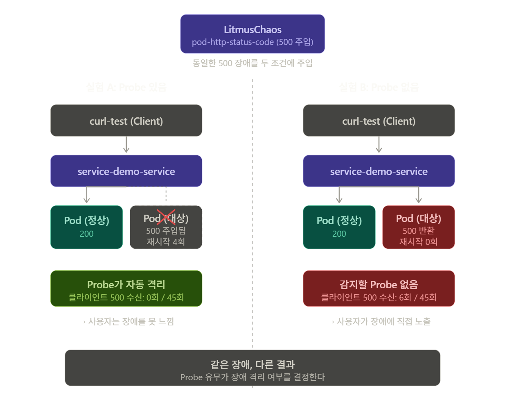
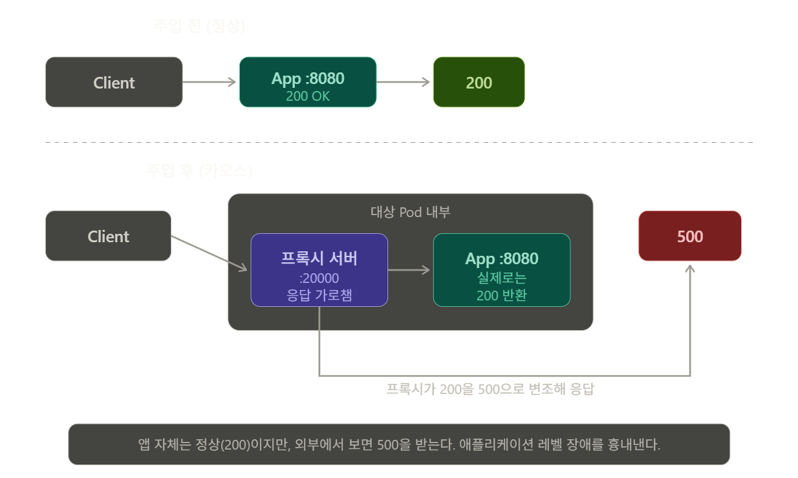

# 20260526 litmus study

# 04. HTTP 500 주입 시 Probe 유무에 따른 Service 트래픽 차이 실험 (LitmusChaos)

## 1. 실험 목적

LitmusChaos의 `pod-http-status-code` 실험을 사용하여 backend Pod의 HTTP 응답을 강제로 500으로 변조한다.

이때 Pod에 Liveness/Readiness Probe가 있는 경우와 없는 경우, Service를 통한 클라이언트 요청 결과가 어떻게 달라지는지 비교한다.

핵심 질문은 다음과 같다.

> Probe는 HTTP 500 같은 애플리케이션 레벨 장애 상황에서 실제로 어떤 방어 역할을 하는가?
> 

---

## 2. 실험 가설

- **Probe가 있는 경우(A)**: 500 응답이 주입되면 Liveness/Readiness Probe(`/healthz`, `/ready`)도 500을 받아 실패한다. 그 결과 해당 Pod는 재시작되거나 Service의 EndpointSlice에서 제외되고, 클라이언트는 정상 Pod로만 라우팅되어 장애를 거의 느끼지 못할 것이다.
- **Probe가 없는 경우(B)**: 500 응답이 주입되어도 이를 감지할 Probe가 없으므로, 해당 Pod는 그대로 트래픽 대상에 남아 클라이언트가 500을 직접 받게 될 것이다.

---

## 3. 실험 환경



### 3-1. 대상 애플리케이션

- Go로 작성한 backend 서버 (`service-demo:v1`)
- Deployment `service-demo` (replicas: 3)
- Service `service-demo-service` (ClusterIP, port 80 → targetPort 8080)
- 클라이언트: `curl-test` Pod (상주)
- Namespace: `week4-service`

### 3-2. 클러스터

- minikube (`k8s-practice` 프로파일)
- Driver: docker
- Container Runtime: docker
- Kubernetes v1.30.0

클러스터 정보 확인:

```powershell
kubectl get nodes -o wide
```

실행 결과:

```
NAME           STATUS   ROLES           VERSION   CONTAINER-RUNTIME
k8s-practice   Ready    control-plane   v1.30.0   docker://28.5.2
```

CONTAINER-RUNTIME이 `docker`이므로, 이후 ChaosEngine에서 `CONTAINER_RUNTIME: docker`와 `SOCKET_PATH: /var/run/docker.sock`을 지정해야 한다.

---

## 4. LitmusChaos 설치

### 4-1. Operator 설치

```powershell
kubectl apply -f https://litmuschaos.github.io/litmus/litmus-operator-v3.0.0.yaml
```

실행 결과:

```
namespace/litmus created
serviceaccount/litmus created
clusterrole.rbac.authorization.k8s.io/litmus created
clusterrolebinding.rbac.authorization.k8s.io/litmus created
deployment.apps/chaos-operator-ce created
customresourcedefinition.apiextensions.k8s.io/chaosengines.litmuschaos.io created
customresourcedefinition.apiextensions.k8s.io/chaosexperiments.litmuschaos.io created
customresourcedefinition.apiextensions.k8s.io/chaosresults.litmuschaos.io created
```

Operator Pod 상태 확인:

```powershell
kubectl get pods -n litmus
```

실행 결과:

```
NAME                                 READY   STATUS    RESTARTS   AGE
chaos-operator-ce-6659cf56d6-l9859   1/1     Running   0          3m2s
```

CRD 등록 확인:

```powershell
kubectl get crds | Select-String chaos
```

실행 결과:

```
chaosengines.litmuschaos.io       2026-05-26T04:47:55Z
chaosexperiments.litmuschaos.io   2026-05-26T04:47:55Z
chaosresults.litmuschaos.io       2026-05-26T04:47:55Z
```

### 4-2. ChaosExperiment 설치

```powershell
kubectl apply -n week4-service -f https://hub.litmuschaos.io/api/chaos/master?file=faults/kubernetes/pod-http-status-code/fault.yaml
```

실행 결과:

```
chaosexperiment.litmuschaos.io/pod-http-status-code created
```

### 4-3. RBAC 설치

실험용 ServiceAccount, Role, RoleBinding을 생성한다 (`pod-http-status-code-sa`). 핵심 권한은 Pod 조회/생성/삭제, events, jobs, litmuschaos 리소스에 대한 CRUD이다.

```powershell
kubectl apply -f manifests/chaos-rbac.yaml
```

실행 결과:

```
serviceaccount/pod-http-status-code-sa created
role.rbac.authorization.k8s.io/pod-http-status-code-sa created
rolebinding.rbac.authorization.k8s.io/pod-http-status-code-sa created
```

---

## 5. 카오스 설정 (ChaosEngine)

`pod-http-status-code` 실험은 대상 Pod 내부에 프록시 서버를 띄우고, 애플리케이션 응답을 가로채 지정한 상태 코드로 변조한다.

```yaml
apiVersion: litmuschaos.io/v1alpha1
kind: ChaosEngine
metadata:
  name: service-demo-http-chaos
  namespace: week4-service
spec:
  engineState: "active"
  annotationCheck: "false"
  appinfo:
    appns: "week4-service"
    applabel: "app=service-demo"
    appkind: "deployment"
  chaosServiceAccount: pod-http-status-code-sa
  experiments:
  - name: pod-http-status-code
    spec:
      components:
        env:
        - name: TARGET_SERVICE_PORT      # Pod 컨테이너 포트 (Service 포트 80이 아님)
          value: "8080"
        - name: PROXY_PORT
          value: "20000"
        - name: STATUS_CODE              # 주입할 상태 코드
          value: "500"
        - name: MODIFY_RESPONSE_BODY
          value: "true"
        - name: TOXICITY                 # 영향받는 요청 비율 (%)
          value: "100"
        - name: TOTAL_CHAOS_DURATION     # 장애 지속 시간 (초)
          value: "60"
        - name: CONTAINER_RUNTIME        # 본 환경은 docker 드라이버
          value: "docker"
        - name: SOCKET_PATH
          value: "/var/run/docker.sock"
```



핵심 설정:

- `TARGET_SERVICE_PORT: 8080` — Service 레벨 포트(80)가 아니라 Pod 컨테이너가 실제 listen하는 포트를 지정해야 한다.
- `CONTAINER_RUNTIME: docker` / `SOCKET_PATH: /var/run/docker.sock` — minikube docker 드라이버 환경에 맞춘 설정. 기본값(containerd)을 그대로 두면 주입에 실패한다.
- `PODS_AFFECTED_PERC` 미지정 — 기본값에 따라 3개 Pod 중 1개만 대상이 된다.

---

## 6. 실험 A: Probe가 있는 경우

### 6-1. 정상 상태 baseline

Service로 10회 요청한 결과, 전부 정상 응답(200)을 확인했다.

```powershell
1..10 | ForEach-Object {
  kubectl exec curl-test -n week4-service -- curl -s -o /dev/null -w "%{http_code}`n" http://service-demo-service
  Start-Sleep -Milliseconds 300
}
```

실행 결과:

```
200 200 200 200 200 200 200 200 200 200
```

응답 본문도 정상 확인:

```json
{"message":"hello from Go service demo","host":"service-demo-5fb9464d7c-x5qc6","podIP":"10.244.0.9","mode":"normal","time":"2026-05-26T05:36:08Z"}
```

대상 Pod 3개:

```
NAME                            READY   STATUS    IP
service-demo-5fb9464d7c-9dbzx   1/1     Running   10.244.0.12
service-demo-5fb9464d7c-shgmn   1/1     Running   10.244.0.13
service-demo-5fb9464d7c-x5qc6   1/1     Running   10.244.0.9
```

### 6-2. 장애 주입

```powershell
kubectl apply -f manifests/chaos-engine-http.yaml
```

주입과 동시에 2초 간격으로 45회 요청을 보내며 상태 코드를 관찰했다.

```powershell
1..45 | ForEach-Object {
  $code = kubectl exec curl-test -n week4-service -- curl -s -o /dev/null -w "%{http_code}" --max-time 3 http://service-demo-service
  Write-Host "$(Get-Date -Format 'HH:mm:ss')  ->  $code"
  Start-Sleep -Seconds 2
}
```

### 6-3. 관찰 결과

45회 요청 동안 **500은 한 번도 관측되지 않았다.**

```
15:15:46  ->  200
15:15:49  ->  200
...
15:17:26  ->  200
(45회 전부 200)
```

그러나 ChaosResult와 Pod 상태를 확인한 결과, 장애 자체는 정상적으로 주입되었다.

```powershell
kubectl describe chaosresult -n week4-service | Select-String -Pattern "Verdict|Name:|Chaos Status|Phase"
```

실행 결과:

```
Phase:           Completed
Verdict:         Pass
Chaos Status:    reverted
Name:            service-demo-5fb9464d7c-shgmn
```

Pod 상태:

```
NAME                            READY   STATUS    RESTARTS
service-demo-5fb9464d7c-shgmn   0/1     Running   4
```

대상 Pod `shgmn`이 **4회 재시작**되었고 일시적으로 `0/1` 상태가 되었다.

### 6-4. 해석

장애 주입 → 대상 Pod 응답이 500으로 변조 → Liveness Probe(`/healthz`)와 Readiness Probe(`/ready`)도 500을 수신 → Probe 실패.

그 결과:

- Liveness 실패 → 컨테이너 재시작 (RESTARTS 4)
- Readiness 실패 → Service의 EndpointSlice에서 해당 Pod 제외

결국 Service는 정상 상태인 나머지 2개 Pod로만 트래픽을 전달했고, 클라이언트는 500을 한 번도 받지 않았다.

> Probe가 HTTP 500 장애를 감지하여 문제 Pod를 자동으로 격리·재시작했고, 클라이언트는 장애의 영향을 거의 받지 않았다.
> 

---

## 7. 실험 B: Probe가 없는 경우

### 7-1. Probe 제거

A와 동일한 조건에서 Probe만 제거하기 위해, Deployment에서 livenessProbe와 readinessProbe를 제거했다. (제거 전 원본을 백업해 두었다.)

```powershell
# 원본 백업
kubectl get deployment service-demo -n week4-service -o yaml > manifests/service-demo-backup.yaml

# probe 제거
kubectl patch deployment service-demo -n week4-service --type=json -p '[{"op":"remove","path":"/spec/template/spec/containers/0/livenessProbe"},{"op":"remove","path":"/spec/template/spec/containers/0/readinessProbe"}]'
```

Probe 제거로 Deployment template이 변경되어 롤링 업데이트가 발생했고, Pod가 새로 생성되었다(IP가 바뀌고 Pod 이름 해시도 변경됨).

```
NAME                            READY   STATUS    RESTARTS   IP
service-demo-7dfff9f8f8-jmfbk   1/1     Running   0          10.244.0.20
service-demo-7dfff9f8f8-qtxsv   1/1     Running   0          10.244.0.19
service-demo-7dfff9f8f8-xstj5   1/1     Running   0          10.244.0.21
```

Probe 제거 확인 (Liveness/Readiness 항목이 출력되지 않음):

```powershell
kubectl describe deployment service-demo -n week4-service | Select-String -Pattern "Liveness|Readiness"
```

실행 결과:

```
(출력 없음 - probe 제거 확인)
```

### 7-2. 정상 상태 baseline

Probe가 없는 상태에서도 정상 동작(200)을 확인했다.

```
200 200 200 200 200 200 200 200 200 200
```

### 7-3. 장애 주입 및 관찰

A와 동일한 ChaosEngine을 적용하고 45회 관찰했다.

실행 결과:

```
15:47:09  ->  200
...
15:47:44  ->  200
15:47:46  ->  500     ← 첫 500 등장
15:47:49  ->  200
...
15:48:12  ->  500
15:48:15  ->  500
15:48:17  ->  500
15:48:20  ->  200
...
15:48:33  ->  500
15:48:36  ->  500
15:48:39  ->  200
...
15:48:53  ->  200
```

총 45회 중 **500이 6회 관측**되었다 (약 13%).

### 7-4. 관찰 결과

```powershell
kubectl describe chaosresult -n week4-service | Select-String -Pattern "Verdict|Name:|Chaos Status"
```

실행 결과:

```
Verdict:         Pass
Chaos Status:    reverted
Name:            service-demo-7dfff9f8f8-xstj5
```

Pod 상태:

```
NAME                            READY   STATUS    RESTARTS
service-demo-7dfff9f8f8-xstj5   1/1     Running   0
```

대상 Pod의 **재시작 횟수가 0회**였다. A에서 4회 재시작했던 것과 명확히 대비된다.

### 7-5. 해석

장애 주입으로 대상 Pod 응답이 500으로 변조되었지만, 이를 감지할 Probe가 없었다.

그 결과:

- Liveness Probe 없음 → 재시작 트리거 없음 (RESTARTS 0)
- Readiness Probe 없음 → Service가 해당 Pod를 계속 트래픽 대상으로 유지

결국 500을 반환하는 Pod가 끝까지 EndpointSlice에 남아 있었고, 그 Pod로 라우팅된 요청(약 13%)은 클라이언트가 500을 그대로 받았다.

500이 33%가 아니라 13%로 나온 이유는, 3개 Pod 중 1개만 대상이었고 kube-proxy의 트래픽 분산이 확률적이기 때문이다(표본이 적으면 편차가 크다).

> Probe가 없으면 HTTP 500 장애가 감지되지 않아, 망가진 Pod가 계속 트래픽을 받고 클라이언트가 장애에 직접 노출된다.
> 

---

## 8. A vs B 비교

| 항목 | A (Probe 있음) | B (Probe 없음) |
| --- | --- | --- |
| 주입한 장애 | HTTP 500 | HTTP 500 (동일) |
| 클라이언트가 받은 500 | 0회 / 45회 | 6회 / 45회 |
| 대상 Pod 재시작 | 4회 | 0회 |
| 대상 Pod의 Service 제외 | 제외됨 (Readiness 실패) | 유지됨 |
| 클라이언트 체감 | 장애 거의 못 느낌 | 일부 요청 실패 경험 |
| ChaosResult Verdict | Pass | Pass |

동일한 장애(HTTP 500)를 주입했지만, Probe 유무에 따라 클라이언트 경험이 완전히 갈렸다.

---

## 9. 결론

LitmusChaos의 HTTP Status Code 실험을 통해, Probe가 애플리케이션 레벨 장애 상황에서 자동 방어막으로 작동한다는 것을 확인했다.

- Service는 단순히 트래픽을 분산할 뿐, 응답이 정상인지 아닌지는 직접 판단하지 않는다.
- 응답 코드 기반의 장애를 걸러내는 역할은 Readiness/Liveness Probe가 담당한다.
- Probe가 있으면 망가진 Pod가 자동으로 격리·재시작되어 클라이언트가 보호되고, Probe가 없으면 망가진 Pod가 그대로 트래픽을 받아 장애가 사용자에게 직접 노출된다.

이는 1주차 Service 정리와 2주차 실험(03. Readiness 실패 Pod의 Service 트래픽 제외)의 결론을 카오스 환경에서 재확인한 것이다. 03 실험에서는 처음부터 not-ready인 Pod가 제외되는 것을 보았다면, 이번 실험에서는 정상이던 Pod에 장애를 주입했을 때 Probe가 그것을 감지해 격리하는 동적인 과정을 확인했다.

> 안정적인 서비스를 위해서는 Service만으로는 부족하며, Probe를 포함한 health check 메커니즘이 함께 구성되어야 한다.
> 

---

## 10. 카오스 엔지니어링 관점 정리

이번 실험은 "정상 상태 정의 → 장애 주입 → 관찰 → 개선점 도출"이라는 카오스 엔지니어링의 기본 흐름을 따랐다.

- **정상 상태(steady state)**: Service 요청이 전부 200 OK
- **주입한 장애**: 대상 Pod의 HTTP 응답을 500으로 변조 (`pod-http-status-code`)
- **관찰 대상**: 클라이언트가 받는 상태 코드, 대상 Pod의 재시작 여부, EndpointSlice 변화
- **발견**: Probe 유무가 장애 격리 여부를 결정한다
- **개선점**: 애플리케이션 레벨 장애를 감지하려면 Readiness Probe가 응답 상태를 반영하도록 설계해야 한다

특히 A 실험에서 "장애를 주입했는데 클라이언트가 전부 200을 받은" 현상은, 처음에는 실험 실패처럼 보였으나 실제로는 **Probe의 복원력**이 작동한 결과이다.

---

## References

- [Litmus Docs - What is Litmus?](https://docs.litmuschaos.io/docs/introduction/what-is-litmus)
- [**Litmus Experiments - Pod HTTP Status Code**](https://litmuschaos.github.io/litmus/experiments/categories/pods/pod-http-status-code/)
- [**Litmus Experiments - Contents (전체 실험 목록)**](https://litmuschaos.github.io/litmus/experiments/categories/contents/)
- [Litmus Concepts - ChaosEngine](https://litmuschaos.github.io/litmus/experiments/concepts/chaos-resources/chaos-engine/contents/)
- [Litmus Concepts - ChaosExperiment](https://litmuschaos.github.io/litmus/experiments/concepts/chaos-resources/chaos-experiment/contents/)
- [Litmus Concepts - ChaosResult](https://litmuschaos.github.io/litmus/experiments/concepts/chaos-resources/chaos-result/contents/)
- [Kubernetes Docs - Pod Lifecycle: Container probes](https://kubernetes.io/docs/concepts/workloads/pods/pod-lifecycle/#container-probes)
- [Kubernetes Docs - EndpointSlices](https://kubernetes.io/docs/concepts/services-networking/endpoint-slices/)
- [Kubernetes Docs - Service](https://kubernetes.io/docs/concepts/services-networking/service/)
- [Principles of Chaos Engineering](https://principlesofchaos.org/)
